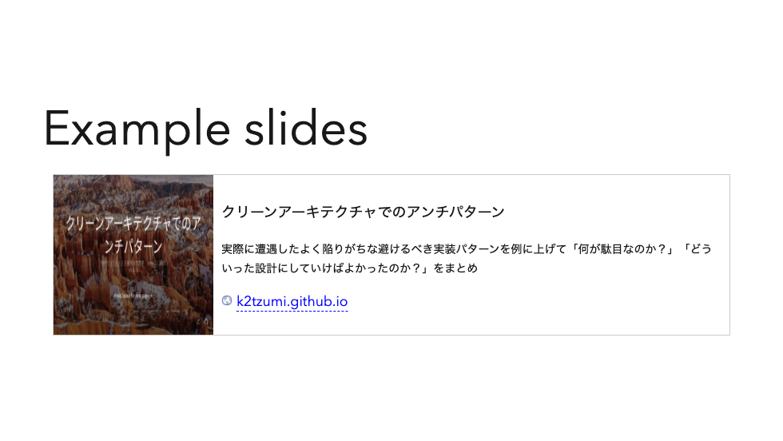

# slidev-addon-blog-card
[Slidev](https://sli.dev/) add-on Blog Card component



## Dependencies

- [axios-jsonp](https://github.com/AdonisLau/axios-jsonp)

## Installation

```console
npm i @katzumi/slidev-addon-blog-card
```

## Slidev Configuration

Define this package into your slidev addons.

In your slides metadata (using Front Matter):

```yaml
addons:
  - "@katzumi/slidev-addon-blog-card"
```

Or in your `package.json`:
```json
{
  "slidev": {
    "addons": [
      "@katzumi/slidev-addon-blog-card"
    ]
  }
}
```

## Components

You can create a link by using the [Blog Card component](#BlogCard).

### BlogCard

```xml
<BlogCard
  url="https://k2tzumi.github.io/schema-driven-development-flow/"
/>
```

Parameters:
* `url` (`string`) : The date will be encoded to the QR code
